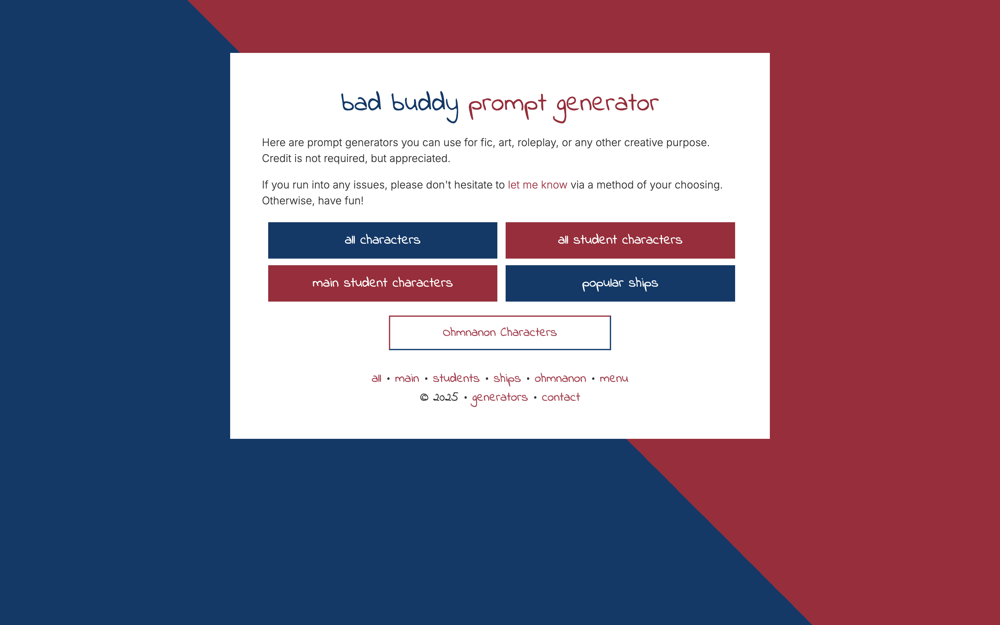

# aroceu's prompt generators
Prompt generators for creative usage, including generic fanwork prompts, fandom specific prompts, lyrical prompts, and other unique generators. Written in PHP, HTML, and CSS; light Javascript for stylistic elements only.

## a little background

When I was younger I stumbled across a lot of writing generators&mdash;I'm a writer, after all&mdash;but a lot of them never really did anything that *I* personally found useful for the way I like to get ideas and write. Mostly because I wrote fanfiction. 

Nevertheless, the first prompt generator that did look usable to me (though I don't believe I ever used it) was a Super Junior prompt generator that picked a random combination of Super Junior members as a ship and a random prompt or two. I saw it and thought to myself, yeah, that's the kind of prompt generator I like. That's the kind that I'd want to use.

But I'm a stylistic nerd so I won't settle for anything that I can't design from ground up myself. When I got into Haikyuu, which has even more characters than Super Junior has members, after a couple of years that inspiration struck me again, and I decided to learn how to make one. By this point I was already familiar with PHP, and as I continued to work on the prompt generators, I've gotten better and more creative with it, though I don't know how my code looks to people with more experience.

Regardless, I use my PHP and webdesign skills for good&mdash;for making generators about (mostly) fictional characters kissing the hell out of each other, not just because I like the characters or making websites, but also because these are the types of generators that I like to use. I added lyric generators in 2020 (mostly for title puroses) and would like to make more, as I'm a big fan of music in general. 

I also made the [Sexy Times With Wangxian tag generator](https://aroceu.com/generators/sexytimes/), which is a highlight. My personal favorite is the [to Lovers generator](http://aroceu.com/generators/lovers/).

# changelog

### 03 May 2025

A few days ago I swapped the color palette on the index page to be white on blue instead of blue on white. It had been bothering me for some time how empty and basic the index page looked, despite it fitting with the motif of my other websites in aesthetic. But then I realized recently that I could fix that by swapping the colors, so! Here we are. I like it a lot more now :)

I also added a <a href="https://aroceu.com/generators/events">fandom event generator</a>, because it had come to me randomly this week and I wanted something to work on as an excuse to procrastinate. So here it is (though I'm still procrastinating.)

### 23 October 2024
Finally putting the code for this on Github! Maybe archiving my changes is important, actually. 

# gallery (overview)

